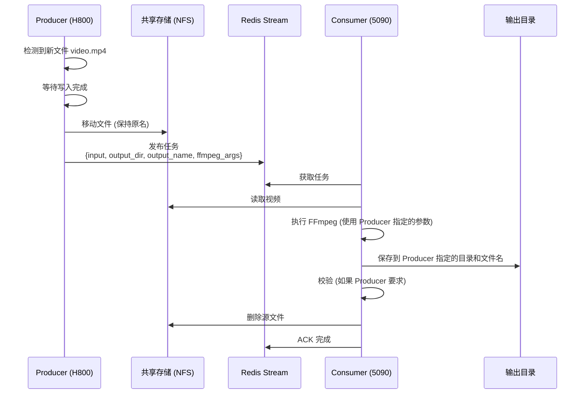

# VCP - Video Codec Pipeline

基于共享存储的分布式视频编码流水线。

## 架构

```
Producer (H800/A800/H200) 决定一切:
├── 输入文件
├── 输出目录
├── 输出文件名
├── FFmpeg 参数
└── 是否校验

Consumer (5090/4090) 只负责执行
```

## 文件流转

```
1. Producer 监听到文件      → /data/raw/video.mp4
2. 移动到共享存储           → /mnt/shared/video.mp4  (文件名不变)
3. Consumer 编码输出        → /data/encoded/video.mp4
4. 删除共享存储源文件       → /mnt/shared/video.mp4 (删除)
```

## 快速开始

```bash
# 1. 启动 Redis
make redis-start

# 2. 构建
make build

# 3. Consumer 端（RTX 5090）
./vcp consumer

# 4. Producer 端（H800）
./vcp producer \
  -w /data/raw \
  -s /mnt/shared \
  -o /data/encoded
```

## Producer 命令

```bash
vcp producer [flags]

必需参数:
  -w, --watch string     监听目录
  -s, --shared string    共享存储目录
  -o, --output string    Consumer 输出目录

可选参数:
      --mode string      监听模式: new(默认) / all
      --prefix string    输出文件名前缀
  -p, --preset string    FFmpeg 预设名称
      --ffmpeg-args      自定义 FFmpeg 参数（覆盖预设）
      --verify           校验输出 (默认 true)
      --keep             保留本地原文件
      --list-presets     列出所有可用预设
  -c, --config string    配置文件路径
```

### FFmpeg 预设

#### 内置预设

| 预设 | 说明 |
|------|------|
| `h264-nvenc` | NVIDIA H.264 编码（默认） |
| `h264-nvenc-hq` | NVIDIA H.264 高质量 |
| `h265-nvenc` | NVIDIA H.265 编码 |
| `h265-nvenc-hq` | NVIDIA H.265 高质量 |
| `h264-cpu` | CPU H.264 编码 |
| `h265-cpu` | CPU H.265 编码 |
| `copy` | 直接复制 |

#### 自定义预设

在配置文件中定义：

```yaml
presets:
  # 自定义高码率预设
  high-bitrate: "-c:v h264_nvenc -preset p4 -b:v 20M -c:a aac -b:a 256k -movflags +faststart"
  
  # 4K 视频预设
  4k-nvenc: "-c:v hevc_nvenc -preset p5 -b:v 30M -c:a aac -b:a 192k -movflags +faststart"
  
  # 可以覆盖内置预设
  h264-nvenc: "-c:v h264_nvenc -preset p6 -b:v 12M -c:a aac -b:a 160k -movflags +faststart"
```

查看所有可用预设：

```bash
./vcp producer --list-presets -c config.yaml
```

### 参数优先级

```
命令行 --ffmpeg-args > 命令行 --preset > 配置文件 ffmpeg_args > 配置文件 ffmpeg_preset > 默认预设
```

### 监听模式

```bash
# 仅监听新文件（默认）
./vcp producer -w /data/raw -s /mnt/shared -o /data/out --mode new

# 处理现有文件 + 监听新文件
./vcp producer -w /data/raw -s /mnt/shared -o /data/out --mode all
```

## Consumer 命令

```bash
vcp consumer [flags]

可选参数:
  -n, --name string      消费者名称
  -j, --concurrency int  并发数 (默认 1)
  -c, --config string    配置文件路径
```

Consumer 只需启动即可，所有编码参数由 Producer 指定。

## 多节点部署

```bash
# H800 节点 1
./vcp producer -w /data/node1 -s /mnt/shared -o /data/out

# H800 节点 2 (使用不同预设)
./vcp producer -w /data/node2 -s /mnt/shared -o /data/out -p h265-nvenc

# RTX 5090 节点
CUDA_VISIBLE_DEVICES=0 ./vcp consumer -n gpu0
CUDA_VISIBLE_DEVICES=1 ./vcp consumer -n gpu1
```

## 配置文件示例

```yaml
redis:
  address: "localhost:6379"

presets:
  high-bitrate: "-c:v h264_nvenc -preset p4 -b:v 20M -c:a aac -b:a 256k -movflags +faststart"
  4k-nvenc: "-c:v hevc_nvenc -preset p5 -b:v 30M -c:a aac -b:a 192k -movflags +faststart"

producer:
  watch_directory: "/data/raw_videos"
  shared_directory: "/mnt/shared/input"
  output_directory: "/data/encoded"
  ffmpeg_preset: "h264-nvenc"
  verify_output: true

consumer:
  concurrency: 1
```

## 时序图

